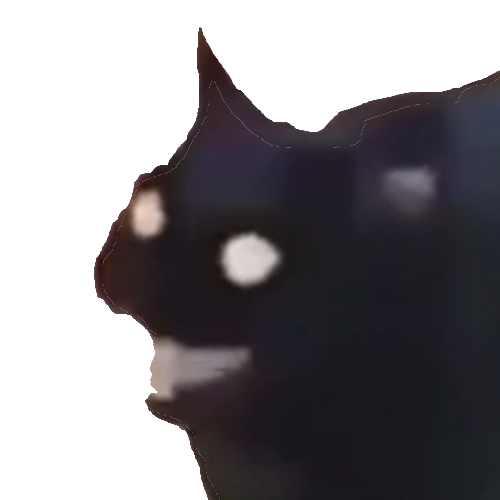

# About
Node.js Discord Bot that acts as a medium for The Void



## Setup
Void Cat is developed using using [Discord.js](https://github.com/discordjs/discord.js) which requires [Node.js 16.6.0](https://nodejs.org/en/download/current/) or newer.

[dotenv](https://github.com/motdotla/dotenv) is used to manage sensitive variables. At the minimum, your `.env` file will need `TOKEN` to run. `GUILD_ID` refers to a discord server id.

```
TOKEN=[bot token]
CLIENT_ID=[app id]
GUILD_ID=[server id]
```

If you want to contribute, it will probably be easiest to create your own bot and use your own token/client id for testing. Follow the steps [here](https://discordjs.guide/preparations/setting-up-a-bot-application.html) to get started. At the moment, your bot will need `bot` and `application.commands` scopes as well as the `Manage Channels` bot persmissions.

## Registering Commands
Before running the app, you should register the commands with your test server. After compiling the TypeScript files, run `deployCommands`.

```
node out/scripts/deployCommands.js
```